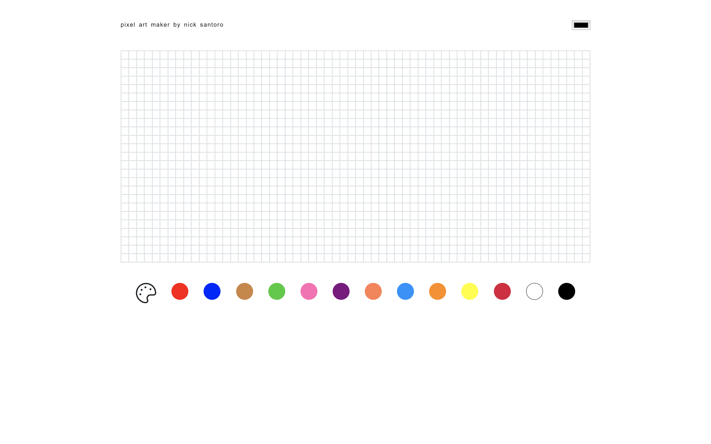
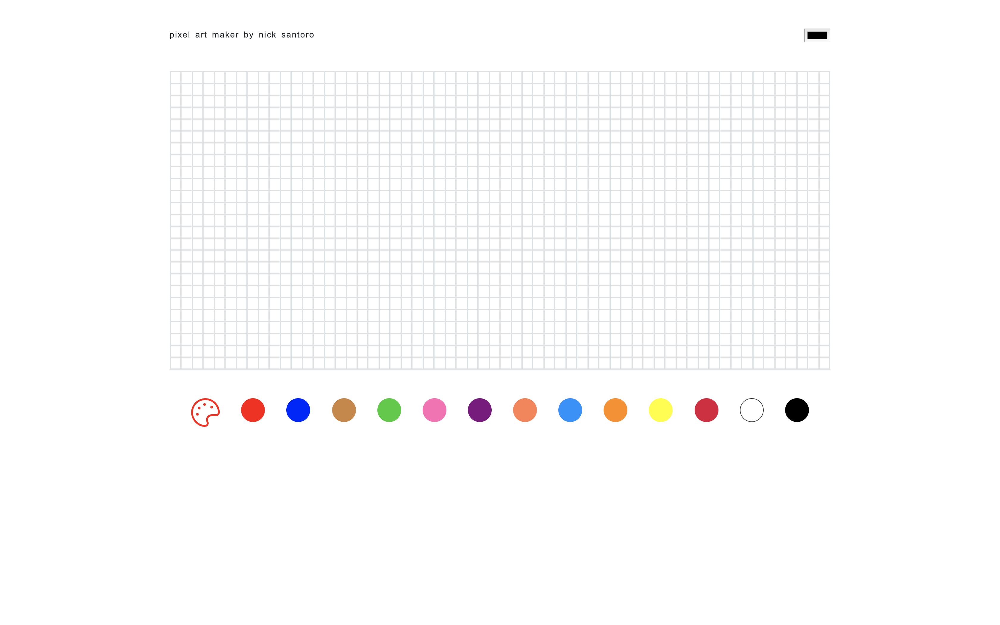
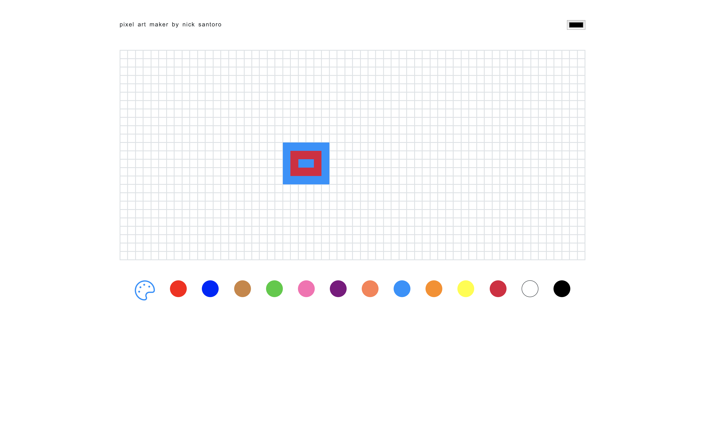

URL: http://nicksantoro-pixelmaker.surge.sh/

# Pixel Art Maker

In this project I created a pixel art maker which will allow a user to choose colors from a palette and then paint pixel art. 

More specifically, this pixel art maker allows a user to do the following:

1. Start with a blank canvas of pixels.
1. Select a brush color from a palette of colors.
1. Paint the pixels on the canvas using the brush color.
1. Repeat step 2.

Here's a development workflow that we recommend you use.

### Future Feature:

Improve the mouse so it behaves like a real paintbrush. In other words, allow the user to paint by clicking and dragging across the canvas. 

Research [LocalStorage](https://developer.mozilla.org/en-US/docs/Web/API/Storage/LocalStorage) and make a way to Save and Load a drawing.  Research [JSON.stringify](https://developer.mozilla.org/en-US/docs/Web/JavaScript/Reference/Global_Objects/JSON/stringify) and [JSON.parse](https://developer.mozilla.org/en-US/docs/Web/JavaScript/Reference/Global_Objects/JSON/parse) as a way to put the drawing into LocalStorage.

### Resources

- [addEventListener](https://developer.mozilla.org/en-US/docs/Web/API/EventTarget/addEventListener)
- [className](https://developer.mozilla.org/en-US/docs/Web/API/Element/className)
- [style](https://developer.mozilla.org/en-US/docs/Web/API/HTMLElement/style)
- [querySelector](https://developer.mozilla.org/en-US/docs/Web/API/Document/querySelector)
- [appendChild](https://developer.mozilla.org/en-US/docs/Web/API/Node/appendChild)

